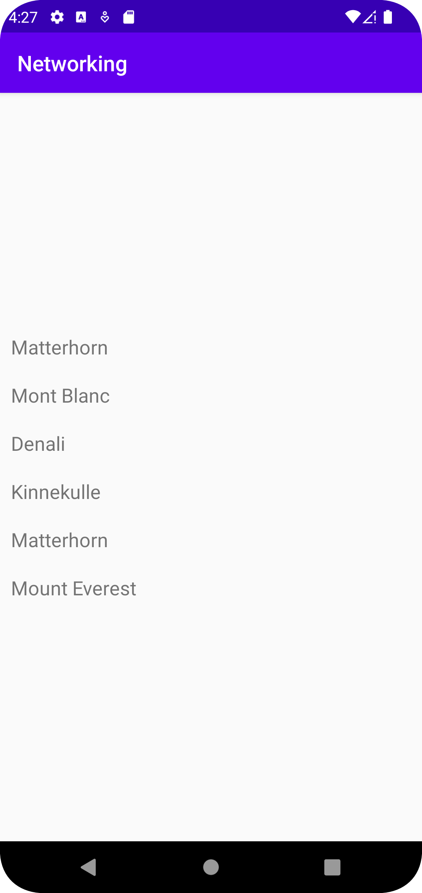

# Rapport

Det har skapats en lista av mountains med hjälp av internet tjänster samt egen skapade array lista(ArrayList<Mountain>. Tittar vi på kod snutten nedan, ser man att tre sycken Mountain object skapas och lagras inuti items listan(items.add(new Mountain("Matterhorn"));):. Dessutom så användes en JSON file som ansvarar för att läsa JSON datan i backgrunden och sedan hanteras datan i onPostexecute() metoden vilket sedan ser till att texten/ datan visas på skärmen.

```
//Items added
....
  items.add(new Mountain("Matterhorn"));
        items.add(new Mountain("Mont Blanc"));
        items.add(new Mountain("Denali"));
        ....
//Jason file
...
new JsonFile(this, this).execute(JSON_FILE)
...
public void onPostExecute(String json) {
        Log.d("MainActivity", "" + json);

        Type type = new TypeToken<List<Mountain>>() {}.getType();
        items = gson.fromJson(json, type);
        for(int i=0;i <items.size(); i++) {
            Log.d("Kyckling2", items.get(i).toString());
            recyclerViewItems.add(new RecyclerViewItem(items.get(i).toString()));
        }
        //adapter.notifyDataSetChanged();
    }
```

Bilder läggs i samma mapp som markdown-filen.



Läs gärna:

- Boulos, M.N.K., Warren, J., Gong, J. & Yue, P. (2010) Web GIS in practice VIII: HTML5 and the canvas element for interactive online mapping. International journal of health geographics 9, 14. Shin, Y. &
- Wunsche, B.C. (2013) A smartphone-based golf simulation exercise game for supporting arthritis patients. 2013 28th International Conference of Image and Vision Computing New Zealand (IVCNZ), IEEE, pp. 459–464.
- Wohlin, C., Runeson, P., Höst, M., Ohlsson, M.C., Regnell, B., Wesslén, A. (2012) Experimentation in Software Engineering, Berlin, Heidelberg: Springer Berlin Heidelberg.
